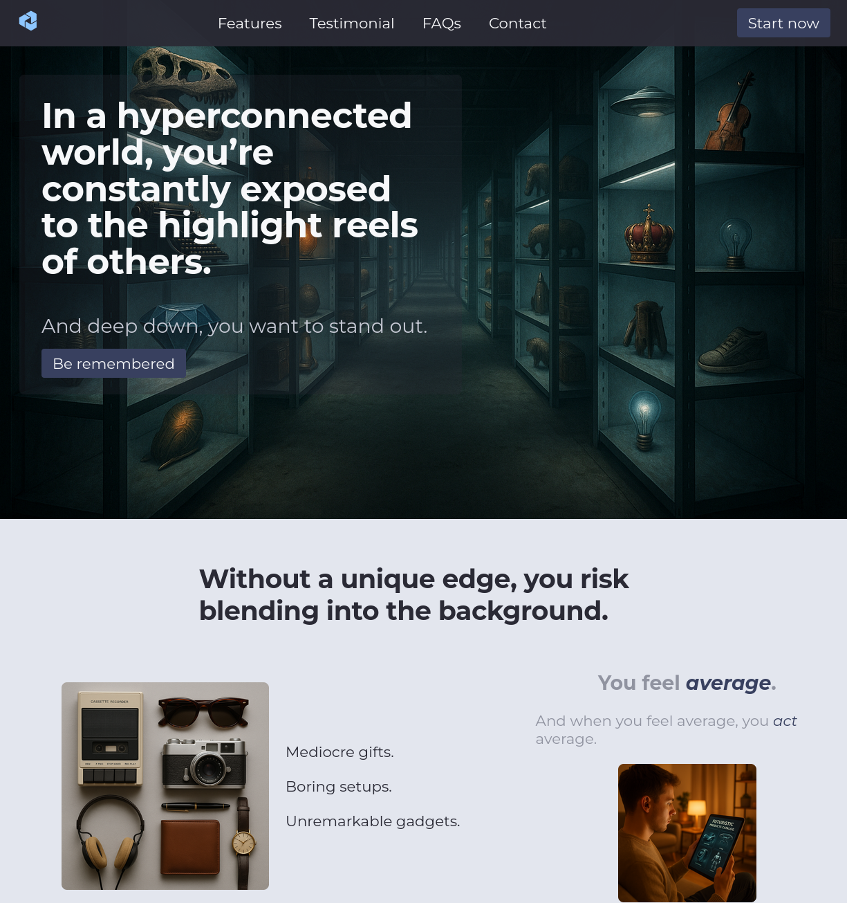
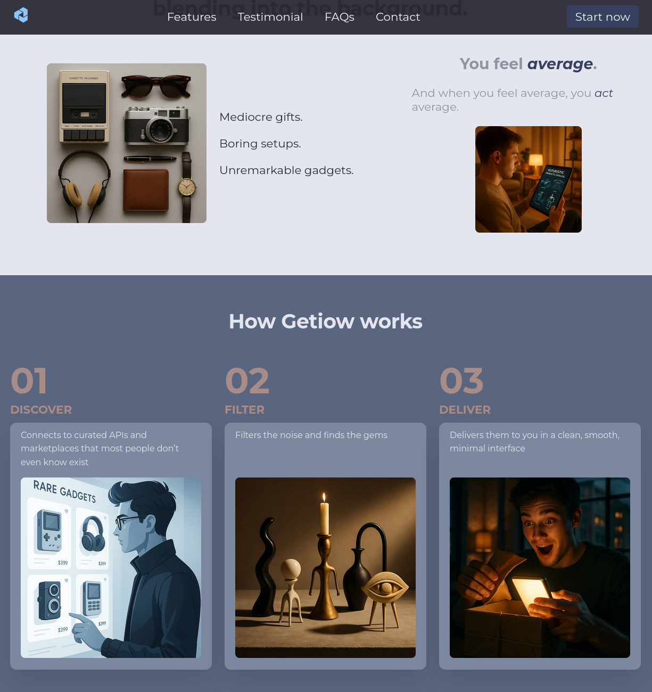
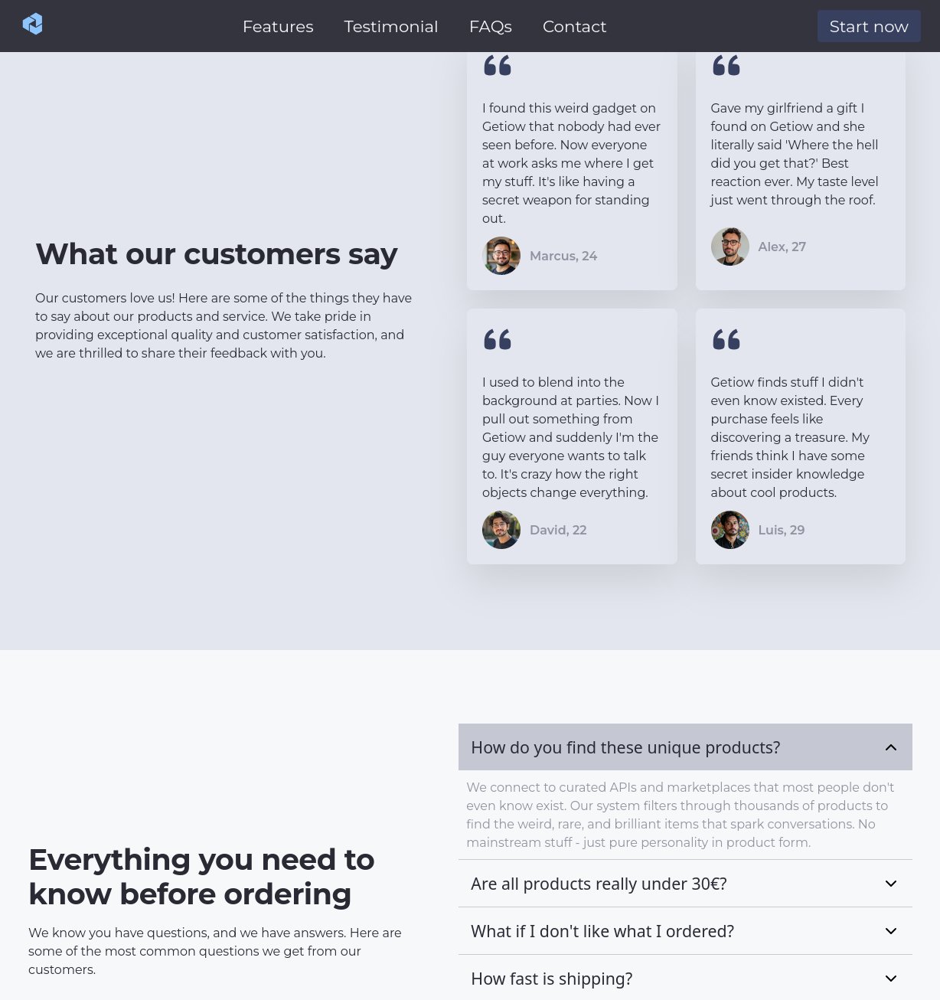
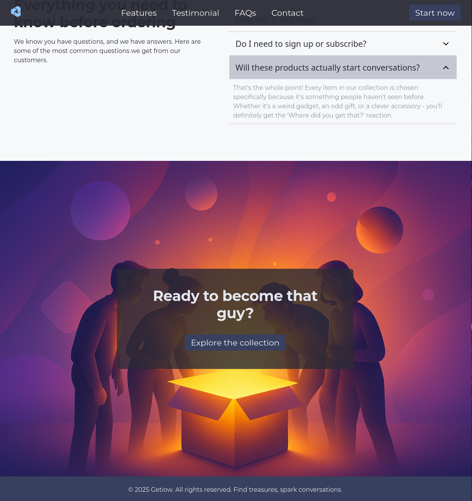
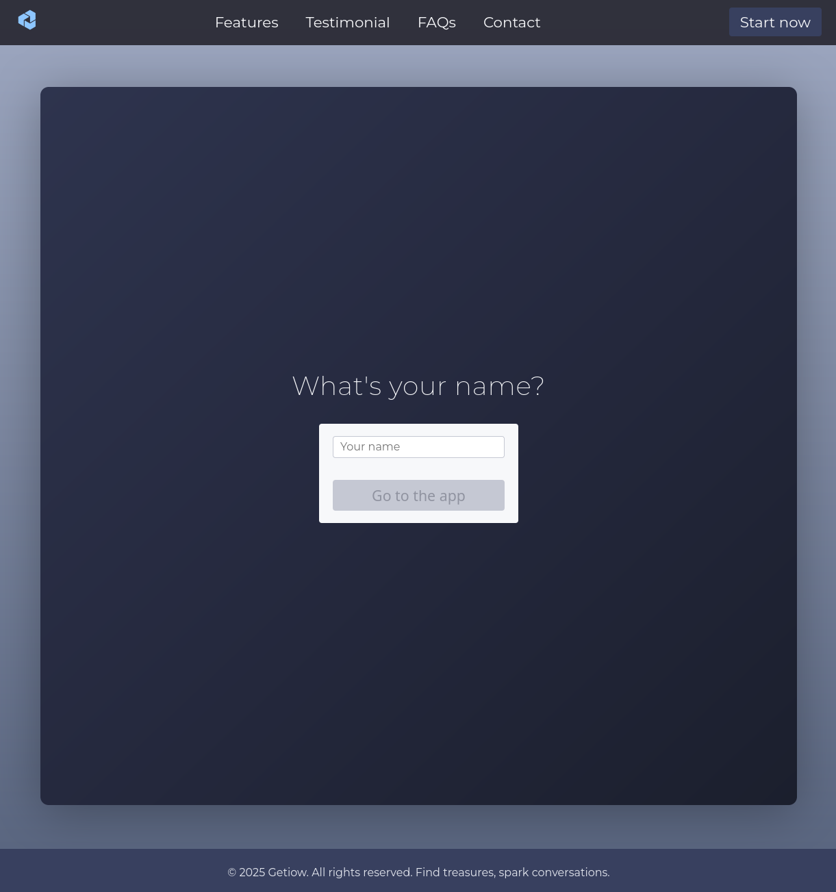
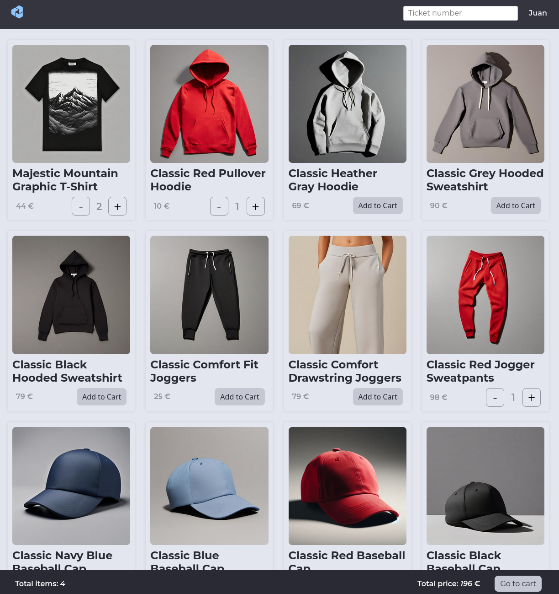
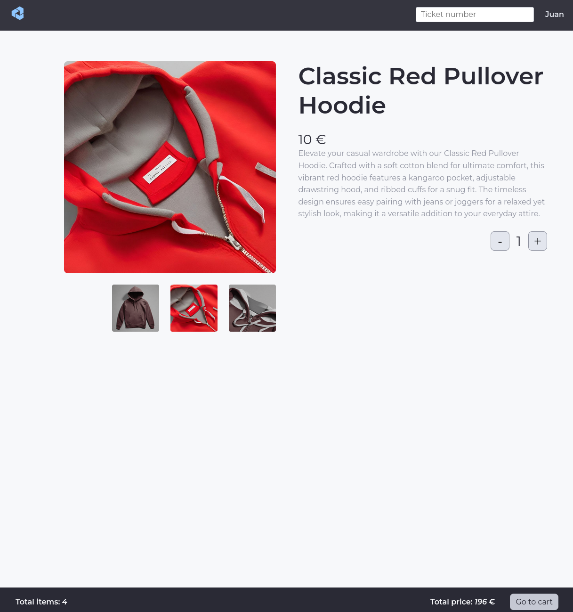
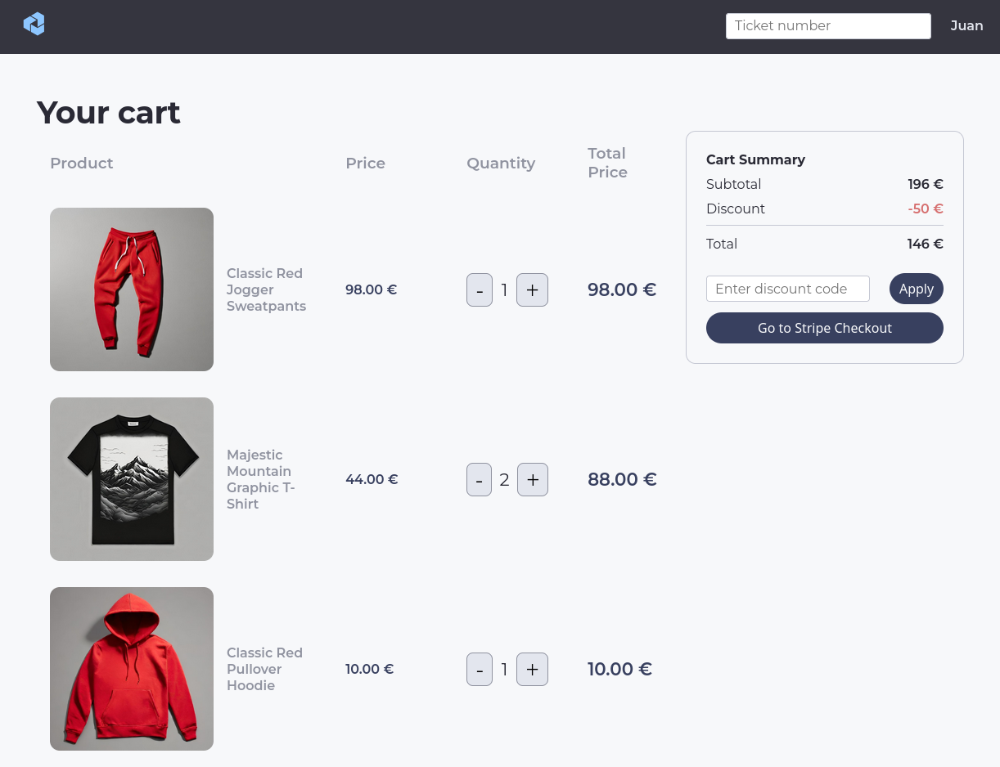
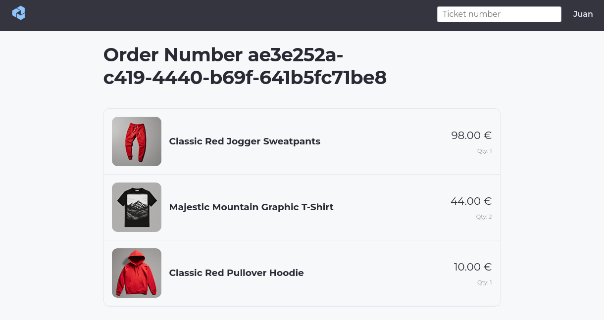

# 🌕 Project's purpose

This is a dummy project whose purpose is to practice these web application concepts:

- Plan a project.
- Use react router data fetching capabilities for remote state management.
- Use redux for UI state management.
- Use a professional file structure.

# 🚀 Features

- No user account is needed.
- Username must be provided to access the app.
- Items can be added to shopping cart.
- Items can be removed from shopping cart.
- Items can be updated from shopping cart.
- Products must be shown to user.
- Products can be fetched by id.
- Previous orders show the items, price and quantity.

# External API Documentation

API DOC: https://fakeapi.platzi.com/en/about/introduction/

# 🖼️ Project's screenshots

## Landing page

## "Login" screen

## Products

## Product details

## Cart

## Order

